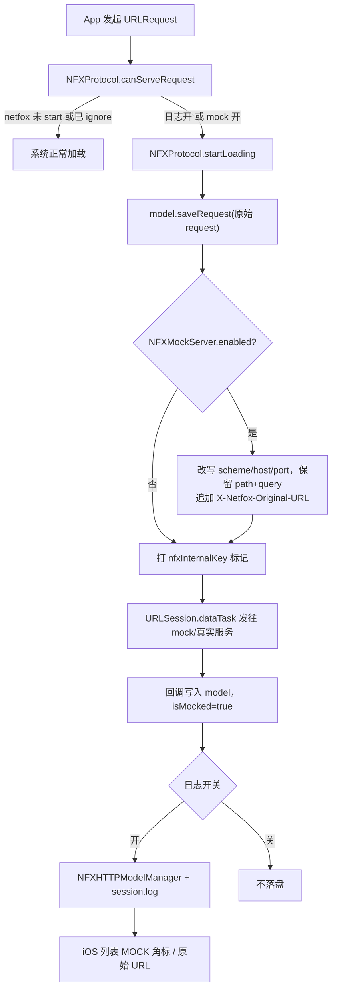

## 产品概述
为 netfox（iOS/OSX 网络调试库）新增「请求重定向到 Mock Server」能力。开启后，被 netfox 拦截的所有 HTTP/HTTPS 请求会保留原有 path 与 query，仅把 scheme + host（+port）替换为开发者指定的 mock server 地址，从而在真机/模拟器上把真实接口流量打到本机或局域网的 mock 服务。

## 核心功能
- **全局 base URL 替换**：配置一个 mock server 地址（如 `http://localhost:3000`），所有请求保留 path/query，只替换 scheme/host/port；不做按前缀或正则的多规则映射。
- **代码 API 配置**：提供 `NFX.sharedInstance().setMockServerURL(...)`、`setMockServerEnabled(...)`、`isMockServerEnabled()`、`getMockServerURLString()`，Swift 与 Objective-C 均可调用，风格与现有 `ignoreURL` / `setCachePolicy` 一致。
- **内置设置页 UI（仅 iOS）**：Settings 页新增 Mock 分组，含「开关 + 地址输入框」，可运行时切换，配置持久化到 UserDefaults（含开关状态与地址）。
- **日志标记**：被重定向的请求仍记录**原始 URL**，并在列表中显示橙色 MOCK 角标，session.log 中追加重定向标记行，便于排查是走了真实服务还是 mock 服务。
- **平台范围**：重定向核心逻辑位于 Core（iOS + OSX 均生效），设置页 UI 只在 iOS 端提供；OSX 端通过代码 API 使用。
- **健壮性**：地址非法时忽略并打印提示而非崩溃；mock 开关独立于「Logging 日志开关」，只要 netfox 已 start 即生效；`ignoreURLs` / 正则忽略仍然优先。
- **文档**：README 新增 Mock server 章节（Swift + ObjC 示例）及 HTTP/本地网络 ATS 注意事项。


## 技术栈
- 语言/框架：Swift 5，Foundation `URLProtocol` 拦截（`NFXProtocol`），UIKit（iOS 设置页）/ AppKit（OSX）
- 分发：CocoaPods（`netfox/Core/*.swift` 通配）、SPM（`path: "netfox/"`）、Carthage、手动拷贝；三者均为目录通配，新增 Core 文件无需改 podspec / Package.swift
- 无第三方依赖；无单元测试目录（本次以编译验证 + 手动冒烟为准）

## 实现思路
在现有拦截链路上做最小侵入扩展：**配置中心化在 `NFX`（与 `ignoredURLs`、`cacheStoragePolicy` 一致），改写动作发生在 `NFXProtocol.startLoading()`**。关键点：`startLoading()` 中 `model.saveRequest(request)` 保存的是**改写前的原始 request**，因此把重定向放在其后即可天然满足「日志记录原始 URL」；同时用 `URLProtocol.property(forKey: nfxInternalKey)` 标记出站请求，避免 mock 请求被自身二次拦截形成递归。

### 关键技术决策
1. **mock 开关与日志开关解耦**：现有 `canServeRequest` 在 `!isEnabled()` 时直接返回 false（协议不参与加载）。改为 `isEnabled() || isMockServerEnabled()`，使关闭日志时 mock 仍生效；同时在 `startLoading`/`didCompleteWithError` 中仅当 `isEnabled()` 时才 `logRequest` 与 `NFXHTTPModelManager.shared.add(model)`，保持「关闭日志就不落盘」的原语义。
2. **线程安全**：`canServeRequest`/`startLoading` 在 URLSession 后台线程执行，而设置页在主线程写入配置。新增 `NFXMockServer` 为 `final class`，内部用 `NSLock` 保护状态，对外暴露不可变快照 `NFXMockConfiguration`，读取 O(1)、无锁竞争风险。
3. **归一化与校验**：`setMockServerURL` 时 trim 后校验必须含 scheme（http/https）与 host，非法则 `print("[NFX]: ...")` 并忽略（与仓库现有 `print("[NFX]: ...")` 日志风格一致）；归一化仅保留 `scheme://host[:port][/可选路径前缀]`，改写时 `组件.path = basePath + 原path`，query/fragment/method/header/body 原样保留。
4. **Host 与溯源头**：若原请求显式带 `Host` 头则保留（便于 mock server 按原域名路由）；额外追加 `X-Netfox-Original-URL` 头携带原始地址，便于 mock 端定位与排查。
5. **UI 布局**：沿用仓库现有「纯 frame 手写布局」风格（无 Auto Layout、无 xib 改动），复用 `NFXOrangeColor()` / `NFXFont()` 等既有样式工具，不引入新样式体系。
6. **pbxproj**：新增 1 个 Core 文件需在 `netfox.xcodeproj/project.pbxproj` 登记（PBXFileReference + PBXBuildFile + Core group children + iOS/OSX 两个 target 的 Sources 阶段）；podspec 与 Package.swift 为通配，无需改动。

### 性能与影响面
- 热路径为 `canServeRequest`：新增一次 `isMockServerEnabled()` 读取（加锁快照），相较已有的 `getIgnoredURLs()` 数组遍历与正则匹配，开销可忽略。
- 改写逻辑仅在 mock 开启时执行，且为单次 `URLComponents` 拷贝，无重复遍历、无额外网络往返。
- 关闭日志、仅开 mock 时会额外走一遍 URLProtocol（相比现状多一次会话代理转发），属必要代价，将在 README 中说明。

## 执行要点（防回归）
- `startLoading()` 中**先**基于原始 request 计算重定向结果，**再**对它做 `mutableCopy` 并 `setProperty(nfxInternalKey)`，否则先设置的 property 会被新副本覆盖，导致递归拦截。
- `model.saveRequest(request)` 仍传原始 request，且改为无条件调用（`saveResponse` 依赖 `requestDate` 计算耗时，缺值会 crash）；仅 `logRequest` 与 `add(model)` 受日志开关控制。
- mock server 自身返回 3xx 时，既有 `willPerformHTTPRedirection` 已移除 `nfxInternalKey`，逻辑无需改动。
- `getNFXIP` 等 netfox 内部请求已打 `nfxInternalKey`，不会被 mock 改写，行为不变。
- 设置页新增 Mock section 需同步改：`numberOfSections`(4→5)、`numberOfRowsInSection`、`cellForRowAt`、`didSelectRowAt`、`heightForRowAt`、`heightForHeaderInSection`、`viewForHeaderInSection`（原有 filter 说明由 section 1 变为 section 2）。
- ObjC 桥接：对外 API 只用 `String`/`Bool` 等可桥接类型，避免 Swift 枚举与值类型。

## 架构设计



- `NFXMockServer`（Core，新增）：配置状态、加锁读写、UserDefaults 持久化、URL 改写，跨平台。
- `NFX`（Core，修改）：持有 `mockServer`，暴露 `@objc` 门面 API，风格同 `ignoreURL` 系列。
- `NFXProtocol`（Core，修改）：拦截条件放宽 + 出站前改写。
- `NFXHTTPModel`（Core，修改）：`isMocked` / `mockTargetURL` 字段与日志标记。
- iOS 展示层（修改）：`NFXSettingsController_iOS` 配置项、`NFXListCell_iOS` 角标。

## 目录结构

```
netfox/
├── Core/
│   ├── NFXMockServer.swift           # [NEW] Mock 配置与改写核心。final class NFXMockServer：NSLock 保护 isEnabled/baseURL/urlString；struct NFXMockConfiguration 为不可变快照；setEnabled/setURLString（含 trim + scheme/host 校验 + 归一化）；redirectedRequest(for:) 基于 URLComponents 替换 scheme/host/port 并保留 path/query/fragment、保留原 Host 头、追加 X-Netfox-Original-URL；UserDefaults 读写（key: com.netfox.mockServer.enabled / .url）。
│   ├── NFX.swift                     # [MODIFY] 新增 internal let mockServer = NFXMockServer()；新增 @objc open setMockServerURL(_:)、setMockServerEnabled(_:)、isMockServerEnabled()、getMockServerURLString()；新增 internal mockRedirectedRequest(for:) 与 mockConfiguration 供协议层读取。
│   ├── NFXProtocol.swift             # [MODIFY] canServeRequest 改为 isEnabled() || isMockServerEnabled()；startLoading 先算重定向再打 nfxInternalKey，命中后标记 model.isMocked/mockTargetURL；didCompleteWithError 中 logRequest 与 add(model) 仅在 isEnabled() 时执行。
│   └── NFXHTTPModel.swift            # [MODIFY] 新增 @objc public var isMocked: Bool = false、@objc public var mockTargetURL: String?；formattedRequestLogEntry() 在被 mock 时追加 "[Mocked] redirected to ..." 标记行。
├── iOS/
│   ├── NFXSettingsController_iOS.swift # [MODIFY] section 数 4→5，Logging 之后插入 Mock 分组：row0 开关（UISwitch，联动 setMockServerEnabled）、row1 地址输入（UITextField，keyboardType .URL，editingDidEnd/return 时 setMockServerURL）；同步改 numberOfRowsInSection/cellForRowAt/didSelectRowAt/heightForRowAt/heightForHeaderInSection/viewForHeaderInSection；新增 header 文案说明「保留 path 与 query」。
│   └── NFXListCell_iOS.swift         # [MODIFY] 新增 mockLabel（"MOCK"，NFXOrangeColor，NFXFontBold 10），frame 置于 typeLabel 之后、circleView 之前；configForObject 中按 obj.isMocked 控制 hidden。
├── netfox.xcodeproj/
│   └── project.pbxproj               # [MODIFY] 登记 NFXMockServer.swift：新增 PBXFileReference + PBXBuildFile，加入 Core group children，并加入 iOS/OSX 两个 target 的 Sources build phase。
└── README.md                         # [MODIFY] Features 新增 mock 条目；新增 "## Mock server" 章节：Swift/ObjC 示例、开关与地址 API、path/query 保留说明、MOCK 角标说明、http/localhost 场景下 ATS（NSAllowsArbitraryLoads / NSAllowsLocalNetworking）提示。
```

约束：不改动 `netfox/OSX/NFXSettingsController_OSX.swift`（OSX 端仅享受 Core 层重定向能力）；不改动现有公开 API 签名；不新增第三方依赖。

## 关键数据结构

```swift
// netfox/Core/NFXMockServer.swift
internal struct NFXMockConfiguration {
    let isEnabled: Bool
    let urlString: String?   // 用户输入的原始文本，用于设置页回显
    let baseURL: URL?        // 归一化后的 scheme://host[:port][/prefixPath]
}

internal final class NFXMockServer {
    var configuration: NFXMockConfiguration { get }   // 加锁返回的不可变快照
    func setEnabled(_ enabled: Bool)
    func setURLString(_ urlString: String?)            // 非法输入仅打印提示并忽略
    func redirectedRequest(for request: URLRequest) -> URLRequest?  // 未开启或改写失败返回 nil
}
```


## Agent Extensions
### Skill
- **lsp-code-analysis**
  - Purpose: 对 `NFXProtocol.startLoading` / `NFX.sharedInstance()` / `NFXListCell.configForObject` 等符号做定义与引用分析，确认本次改动的完整影响面（尤其设置页 section 索引相关的所有 switch 分支与 OSX 端调用点）
  - Expected outcome: 输出全部需同步修改的调用点清单，避免漏改 section 索引或遗漏 `NFXProtocol` 的其他使用方

### SubAgent
- **code-explorer**
  - Purpose: 在修改 `project.pbxproj` 前，定位 Xcode 工程内 Core group、两个 target 的 Sources build phase 与既有 Swift 文件的登记范式
  - Expected outcome: 得到可直接套用的文件登记片段（UUID 风格与插入位置），保证新增文件能被 iOS/OSX 两个 target 正确编译
