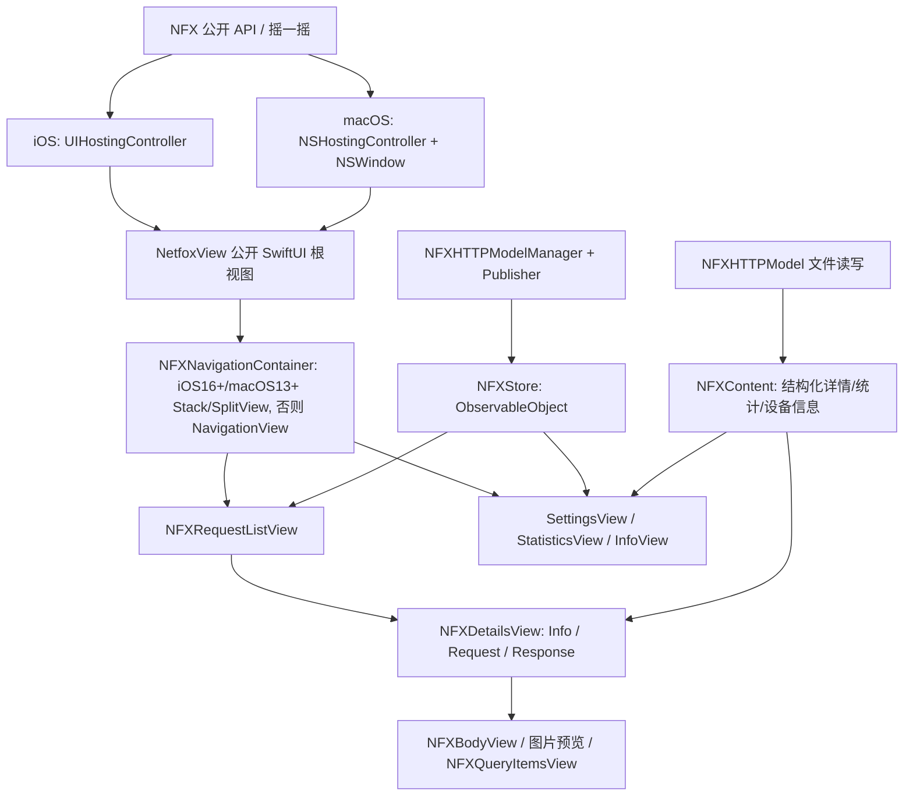

## 产品概述
netfox 是一个一行代码接入的网络调试库，用于在 App 内查看所有被拦截的 HTTP 请求。本次需求是把 iOS 与 macOS 的调试面板全部用 SwiftUI 重写，打造现代化、系统级的观感；最低支持版本调整为 iOS 15（配套 macOS 12），在更高系统上渐进式启用 NavigationStack/NavigationSplitView 等新能力。

## 核心功能
- **请求列表**：可搜索的请求流，展示方法、状态码、URL、耗时、响应类型、MOCK 标记与未读指示，支持清空数据。
- **请求详情**：Info / Request / Response 分段切换，结构化展示请求头、响应头与 body，支持复制、查看超长 body、查看 URL Query 参数。
- **Body 与图片预览**：完整请求/响应 body 文本（等宽字体、可复制、可分享），图片响应自适应预览。
- **设置**：日志开关、Mock Server 开关与服务器地址、响应类型过滤、分享会话日志、清空数据、版本与项目链接。
- **统计**：请求总数、成功/失败占比、请求与响应体积、平均/最快/最慢响应时间，卡片化呈现。
- **设备信息**：应用名/版本/build/包名、设备型号/系统/分辨率、IP 地址（异步加载）。
- **入口兼容**：保留 `NFX.show()/hide()/toggle()` 与摇一摇入口；新增 SwiftUI 入口（可直接嵌入或 sheet 呈现的根视图与修饰符）。

## 视觉效果
中性系统色 + 卡片化分组，弱化原有橙色品牌色；自动适配深色模式，圆角卡片、细分隔线、状态语义色（成功/失败/无响应/MOCK）、SF Symbols 图标、等宽字体展示报文内容，空态与加载态有专属占位。


## 技术栈
- 语言：Swift 5（`SWIFT_VERSION = 5.0`），Xcode 14+ / swift-tools-version 5.7
- UI：SwiftUI，基线 **iOS 15 / macOS 12**；`if #available(iOS 16, macOS 13, *)` 时渐进启用 NavigationStack / NavigationSplitView
- 宿主桥接：iOS `UIHostingController`；macOS `NSHostingController` + 代码创建 `NSWindow`（替代 `NetfoxWindow.xib`）
- 数据层：复用现有 `NFXHTTPModelManager` 的自定义 `Publisher/Subscription`（非 Combine，主线程回调），新增 `ObservableObject + @Published` Store 做 UI 绑定
- 支撑能力：`UIPasteboard`/`NSPasteboard` 复制、`UIViewControllerRepresentable` 包裹 `UIActivityViewController`/`MFMailComposeViewController`、macOS `NSSharingService`
- 工程：Xcode 工程（`netfox.xcodeproj`）、SwiftPM（`Package.swift`）、CocoaPods（`netfox.podspec`）

## 实现思路
1. **先解耦再重写**：把 `NFXDetailsController`/`NFXStatisticsController`/`NFXInfoController`/`NFXGenericController` 中的 NSAttributedString 拼装逻辑抽成纯数据结构（分组 + key/value + body），SwiftUI 原生渲染；导出日志复用纯文本生成路径。
2. **一套 SwiftUI 代码两平台**：新增 `netfox/UI/`，iOS 与 macOS 共同编译；列表/详情/设置/统计/信息页面共享，仅导航容器与窗口宿主按平台分叉。
3. **入口双向兼容**：`NFX.show()` 内部改为 present SwiftUI，公开 API 与摇一摇行为不变；新增 `NetfoxView` 与 `.netfoxPanel(isPresented:)` 作为 SwiftUI 入口。
4. **图标去资源化**：用 SF Symbols（`gearshape`、`xmark`、`info.circle`、`chart.bar`、`trash`、`doc.on.doc`）替换 `NFXAssets` 的 base64 图片，减小体积并自动适配平台。

## 关键技术决策与权衡
- **iOS 15 / macOS 12 下限（用户已确认调整）**：换取更广的宿主覆盖面。代价是放弃 `@Observable`、`NavigationStack`、`ContentUnavailableView`、`LabeledContent`、`Swift Charts` 等 iOS 16/17 API。替代方案：状态用 `ObservableObject + @Published`；空态用自定义 `NFXEmptyStateView`；图表用自绘 `Capsule/RoundedRectangle` Shape；导航抽一层 `NFXNavigationContainer` 做可用性分支（≥iOS 16/macOS 13 走 NavigationStack/SplitView，否则 NavigationView）。
- **删除 UIKit/AppKit UI 而非并存**：用户要求「重新设计所有 UI 页面」，双套 UI 维护成本高且行为易不一致；故删除 `netfox/iOS/*`、`netfox/OSX/*` 与全部 xib，`NFXWindowController` 由 SwiftUI 窗口控制器取代，Core 仅保留纯逻辑。
- **结构化详情 vs UIViewRepresentable(UITextView)**：Representable 渲染 NSAttributedString 在双端表现不一致，且无法利用 SwiftUI 的文本选择、动态字体与无障碍；结构化渲染更可维护，并天然支持「单项复制」按钮（替代长按手势）。
- **性能**：请求量可达数千条。Store 仅在 manager 通知时整体赋值数组（主线程）；列表用 `List` 懒加载；搜索在 Store 内单次 O(n) 过滤 + 轻量防抖（约 100ms，`DispatchWorkItem` 取消上一次）；body 按 1024 字节阈值内联，超长才进入独立页面读取文件；统计在模型集合变化时惰性计算并缓存，避免随视图重绘重复计算。行视图避免 `AnyView` 与复杂 stack 嵌套以保证滚动帧率。

## 实现注意事项
- **必须保留**：未提交的 Mock Server 能力（`NFXMockServer`、`setMockServerURL/Mappings` 等），设置页需完整承载；`UIScreen.nfx_main`、`UIWindow.keyWindow`（iOS 26 兼容）、`nfxSafeFileName`、`NFXPath` 等近期修复不得回退。
- **可用性写法**：所有 iOS 16+/macOS 13+ API 必须包在 `if #available` 内，禁止直接调用 NavigationStack、`Table(iOS)`、`LabeledContent`、`ContentUnavailableView`、`.scrollContentBackground`、`.contentTransition`、`Font.monospaced()`；等宽字体统一用 `.font(.system(.body, design: .monospaced))`。
- **清理**：`NFXConstants.swift` 的 `NFXViewController`/`NFXImage` typealias 随控制器删除一并清理；`NFXColor/NFXFont` 若 Core 仍用则保留，UI 层改用 SwiftUI `Color/Font`；`NFXHelper.swift` 中 base64 图片扩展删除。
- **SwiftUI 生命周期注意**：macOS 12 的 `NavigationView` 双列需配合 `.listStyle(.sidebar)` 与 frame 约束；iOS 15 `.searchable` 需挂在 `NavigationView` 内的列表上；`ObservableObject` 更新必须主线程。
- **工程配置**：SwiftPM 目标原本 `exclude: ["OSX"]`，删除 OSX 目录后需移除，`.iOS(.v15)`/`.macOS(.v12)` 需 swift-tools-version ≥ 5.5（建议 5.7）；podspec `source_files` 需覆盖 `netfox/UI/**`；pbxproj 两个 target 的 Debug/Release 共 4 处 `IPHONEOS_DEPLOYMENT_TARGET` 与 2 处 `MACOSX_DEPLOYMENT_TARGET` 需同步，并清理 xib 文件引用与资源。

## 架构设计

- 数据流：`NFXProtocol` 拦截 → `NFXHTTPModelManager.add()` → `Publisher` 通知 → `NFXStore` 更新 → SwiftUI 重绘。
- 交互回流：设置/过滤/清空 → `NFX` 与 `NFXHTTPModelManager` 单例 → 再次通知 Store，保持单一数据源。

## 目录结构
```
netfox/
├── Core/
│   ├── NFX.swift                     # [MODIFY] iOS 分支改为 present UIHostingController(NetfoxView)；macOS 分支改为 SwiftUI 窗口控制器；新增 SwiftUI 版入口；保留全部 @objc API 与摇一摇
│   ├── NFXContent.swift              # [NEW] 纯数据层：NFXDetailsContent（分组/字段/body/是否截断）、NFXStatisticsSummary、NFXDeviceInfo（含异步 IP），并提供导出用的纯文本
│   ├── NFXStore.swift                # [NEW] ObservableObject 状态容器：模型列表、搜索文本（防抖）、过滤、选中模型；订阅 NFXHTTPModelManager.publisher
│   ├── NFXHTTPModelManager.swift     # [MODIFY] 视需要补充通知时机，保持主线程约定
│   ├── NFXHelper.swift               # [MODIFY] 删除 UI 相关颜色/字体/图片扩展，保留 HTTPModelShortType、NFXPath、Publisher/Subscription、UIScreen.nfx_main
│   ├── NFXConstants.swift            # [MODIFY] 移除无用 typealias
│   ├── NFXWindowController.swift     # [DELETE] 由 UI/Mac/NFXMacWindowController.swift 取代
│   ├── NFXGenericController.swift    # [DELETE] 逻辑迁至 NFXContent.swift
│   ├── NFXDetailsController.swift    # [DELETE]
│   ├── NFXListController.swift       # [DELETE]
│   ├── NFXSettingsController.swift   # [DELETE]
│   ├── NFXStatisticsController.swift # [DELETE]
│   ├── NFXInfoController.swift       # [DELETE]
│   ├── NFXImageBodyDetailsController.swift # [DELETE] 功能并入 UI/NFXBodyView.swift
│   └── NFXAssets.swift               # [DELETE] 改用 SF Symbols
├── UI/                               # [NEW] 共享 SwiftUI 层（iOS 15+ 与 macOS 12+ 同编译）
│   ├── NFXTheme.swift                # [NEW] 中性配色、字体（含 design: .monospaced）、圆角/阴影、状态色、卡片与标签样式
│   ├── NFXNavigationContainer.swift  # [NEW] 可用性分支导航容器（Stack/SplitView vs NavigationView）
│   ├── NetfoxView.swift              # [NEW] 公开根视图 + .netfoxPanel(isPresented:) 修饰符
│   ├── NFXStoreEnv.swift             # [NEW] Environment 注入 Store 与关闭回调
│   ├── NFXRequestListView.swift      # [NEW] 请求列表：.searchable、自定义空态、清空、工具栏
│   ├── NFXRequestRowView.swift       # [NEW] 请求行：状态色条、方法徽章、URL、耗时、类型、MOCK、未读点
│   ├── NFXDetailsView.swift          # [NEW] Info/Request/Response 分段（TabView + 分段控件），结构化字段与复制
│   ├── NFXBodyView.swift             # [NEW] 完整 body 文本/图片预览
│   ├── NFXQueryItemsView.swift       # [NEW] URL Query 参数列表
│   ├── NFXSettingsView.swift         # [NEW] 日志开关、Mock Server、类型过滤、分享日志、清空、版本信息
│   ├── NFXStatisticsView.swift       # [NEW] 统计卡片网格 + 自绘占比条
│   ├── NFXInfoView.swift             # [NEW] 设备与应用信息
│   ├── NFXEmptyStateView.swift       # [NEW] 替代 ContentUnavailableView 的空态/无结果占位
│   ├── Components/                   # [NEW] StatusPill、MethodBadge、KeyValueRow、CardContainer、CopyButton、TagView
│   ├── Sharing/                      # [NEW] ShareSheet(UIViewControllerRepresentable)、MailSheet、MacSharing、curl 导出
│   └── Mac/
│       ├── NFXMacWindowController.swift # [NEW] NSWindow + NSHostingController 承载 SwiftUI，替代 xib 窗口
│       └── NFXMacRootView.swift      # [NEW] NavigationSplitView/NavigationView 双列布局（列表 + 详情）
├── iOS/                              # [DELETE] 9 个 UIKit 文件全部移除
└── OSX/                              # [DELETE] 全部 AppKit 文件与 NetfoxWindow.xib、两个 cell xib
```
工程与配置文件：
```
Package.swift                 # [MODIFY] platforms 改为 .iOS(.v15)/.macOS(.v12)；移除 exclude ["OSX"]；swift-tools-version 提升（≥5.5，建议 5.7）
netfox.podspec                # [MODIFY] ios.deployment_target='15.0'、osx.deployment_target='12.0'；source_files 覆盖 netfox/UI/**
netfox.xcodeproj/project.pbxproj # [MODIFY] IPHONEOS_DEPLOYMENT_TARGET=15.0、MACOSX_DEPLOYMENT_TARGET=12.0（framework 与 demo 的 Debug/Release）；增删文件引用、移除 xib
netfox_ios_demo/AppDelegate.swift、SceneDelegate.swift、Info.plist # [MODIFY] 部署目标同步，演示 SwiftUI 入口
README.md                     # [MODIFY] 更新最低版本、SwiftUI 入口用法与所需 Xcode 版本
```

## 关键接口（iOS 15 / macOS 12 基线）
```swift
// 结构化详情（取代 NSAttributedString 拼装）
struct NFXContentSection { let title: String?; let fields: [NFXContentField]; let body: NFXContentBody? }
struct NFXContentField { let key: String; let value: String }
struct NFXContentBody { let text: String?; let isTruncated: Bool; let byteLength: Int }
struct NFXDetailsContent { let info: NFXContentSection; let request: NFXContentSection; let response: NFXContentSection?; let plainTextLog: String }

// UI 单一数据源（iOS 15 不支持 @Observable，使用 ObservableObject）
@available(iOS 15.0, macOS 12.0, *)
public final class NFXStore: ObservableObject {
    @Published private(set) var models: [NFXHTTPModel] = []
    @Published var searchText: String = ""
    @Published var filters: [Bool] = NFXHTTPModelManager.shared.filters
    var displayedModels: [NFXHTTPModel] { get }   // 单次 O(n) 过滤
    func clear()                                   // 调用 NFX.sharedInstance().clearOldData()
}

// 新的 SwiftUI 入口（旧入口保留）
@available(iOS 15.0, macOS 12.0, *)
public struct NetfoxView: View { public init() }
@available(iOS 15.0, macOS 12.0, *)
public extension View { func netfoxPanel(isPresented: Binding<Bool>) -> some View }
```


## 应用类型
iOS 与 macOS 双平台的 App 内嵌调试面板（iOS 以 sheet/全屏呈现，macOS 以独立窗口呈现），采用系统原生观感。基于 iOS 15 / macOS 12 基线实现，外观使用 SwiftUI 原生组件（Form/List/NavigationView）与自绘组件，不依赖 UIKit/AppKit 自定义控件。

## 设计风格
中性系统色 + 卡片化分组，接近系统「设置」的视觉语言：浅色为 #F2F2F7 底 + 纯白圆角卡片，深色为 #1C1C1E 底 + #2C2C2E 卡片；强调色用系统蓝，状态色仅作语义（成功/失败/无响应/MOCK）；SF Symbols 线性图标、16pt 圆角、1px 细分隔线、轻微按压反馈与淡入动画。

## 页面设计

### 1. 请求列表（iOS 主页面 / macOS 左栏）
- 顶部导航栏：标题「Requests」，左侧关闭，右侧清空与设置图标。
- 搜索栏：`.searchable` 常驻，输入经轻量防抖后过滤 URL / 方法 / 类型。
- 请求卡片列表：左侧状态色条（绿/红/灰），右侧方法徽章、URL（两行截断）、耗时、响应类型、MOCK 标签、未读圆点。
- 空态：无请求或无搜索结果时显示自定义 `NFXEmptyStateView`（替代 iOS 17 的 ContentUnavailableView）。

### 2. 请求详情
- 分段控件：Info / Request / Response，`TabView(.page)` 支持滑动切换并带选中态下划线动画。
- 概览卡：状态码胶囊、方法、时长、时间等核心指标置顶。
- 分组字段：Headers / Body 分区，key 次级灰、value 主色，右侧复制按钮；body 超 1024 字节显示「查看完整内容」。
- 右上角菜单：Simple log / Full log / Export as curl / 复制 URL。

### 3. Body 与图片预览
- 文本 body：等宽字体（`.system(.body, design: .monospaced)`）、可滚动、保留换行，一键复制与分享。
- 图片响应：自适应缩放预览，顶部显示尺寸与类型，支持分享。
- URL Query 页：参数名/值两列列表，单项可复制。

### 4. 设置
- 分组卡片：Logging（开关）、Mock Server（开关 + 地址输入 + 映射说明）、Response Types（勾选过滤）、Session（分享会话日志）、Data（清空，红色破坏性操作）。
- 底部：版本号与项目链接（中性灰小字）。
- macOS 以窗口工具栏入口呈现，iOS 由列表页工具栏 push。

### 5. 统计
- 指标卡片网格：总请求、成功/失败、请求/响应体积、平均/最快/最慢耗时，大数字 + 次级标签。
- 成功/失败占比用自绘 Capsule 进度条表达（不使用 Swift Charts），随数据变化带数字滚动/淡入。
- 空数据时展示占位说明而非 0 值堆叠。

### 6. 设备信息
- 分组列表：应用（名称/版本/build/包名）、设备（型号/系统/分辨率）、网络（IP，异步加载带占位）。
- 每项支持复制，整体支持导出。

## 响应式与适配
iOS 支持 Dynamic Type 与横竖屏；macOS 使用双列导航并设置窗口最小尺寸与列宽约束；两平台均自动适配深色模式与系统强调色。

## Agent Extensions
### SubAgent
- **code-explorer**
  - 用途：在删除 UIKit/AppKit UI 前后，全仓检索所有对 `NFXListController_iOS`、`NFXListController_OSX`、`NFXWindowController`、`NFXGenericController`、`NFXAssets`、`NFXViewController`、xib 名称及 `UIImage.NFX*` 的引用（含 `project.pbxproj`、`Package.swift`、`netfox.podspec`、`netfox_ios_demo`），并核查 iOS 15 基线下的 API 合规点。
  - 预期结果：输出完整引用清单、受影响文件列表，以及违反 iOS 15/macOS 12 基线的 API 使用点，作为删除与配置修改的依据。
